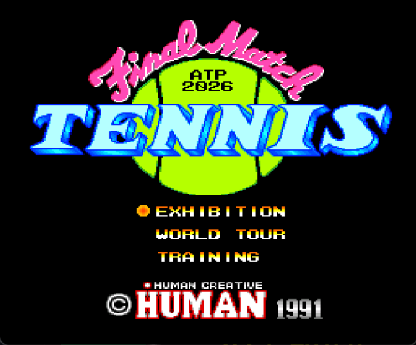
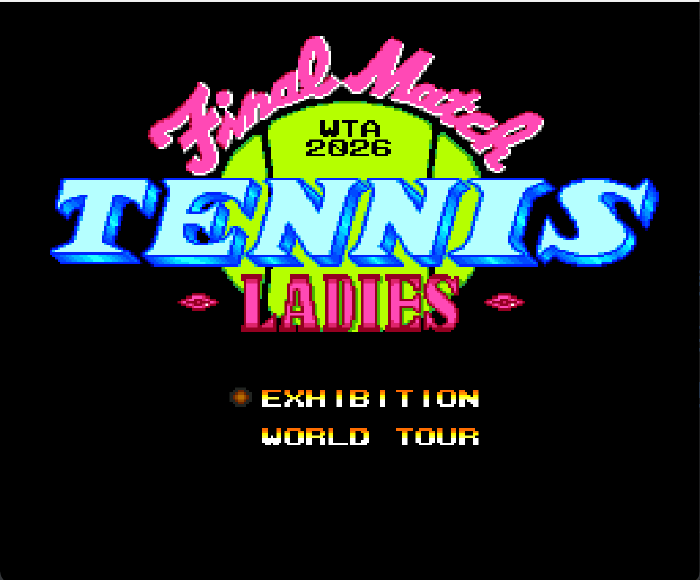
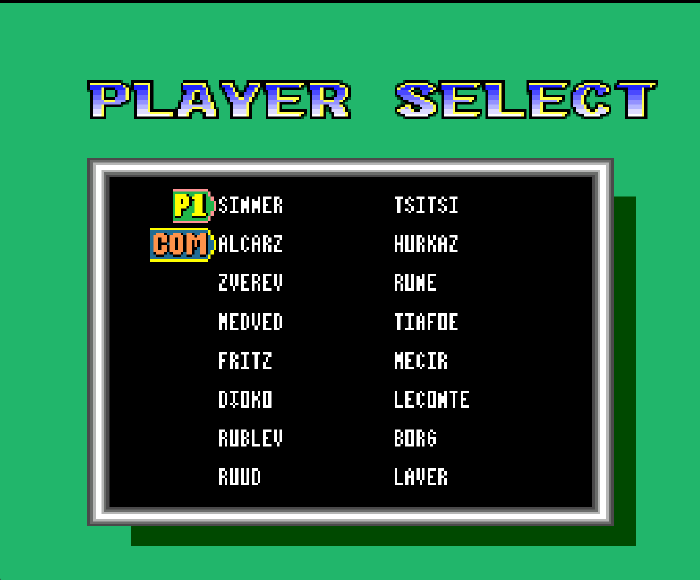
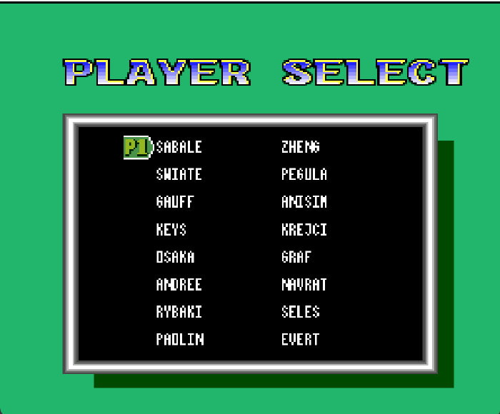
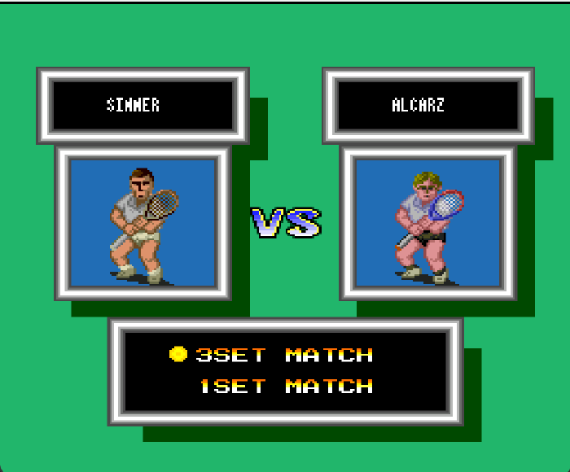
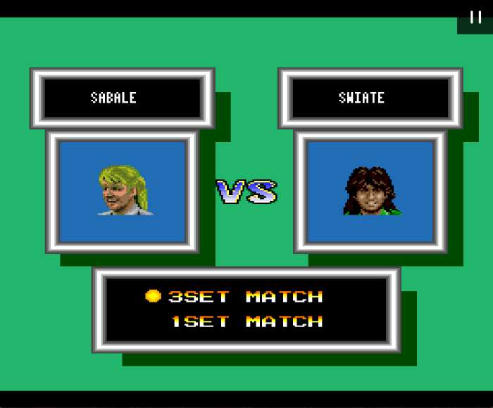
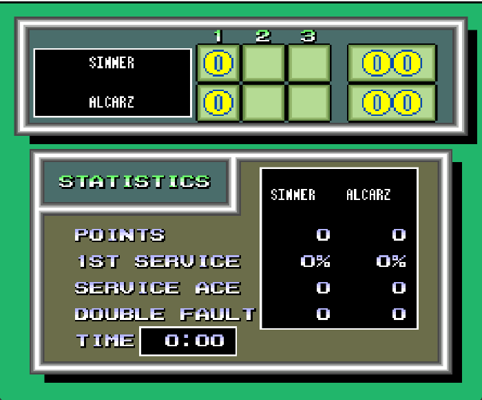
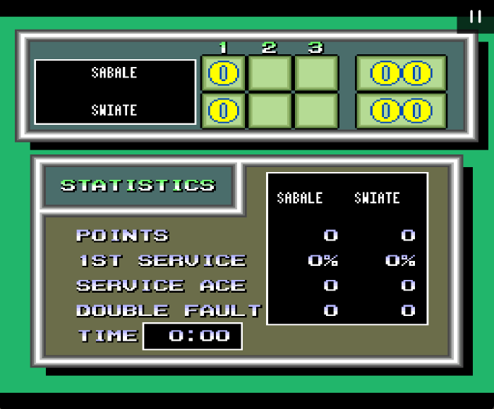

# Final Match Tennis 2026 - Modern Roster Mods

ROM hacks that replace the 1990-era player rosters of two PC Engine / TurboGrafx-16
tennis games with today's top ATP and WTA players - while keeping every original
gameplay attribute, sprite, and animation intact.

Two patches are included:

| Patch | Game | Roster |
|-------|------|--------|
| **Men** | *Final Match Tennis* (HuCard) | 2026 ATP top players |
| **Ladies** | *Final Match Tennis Ladies* (from *Human Sports Festival* CD) | 2026 WTA top players |

Both are distributed as **IPS patches** - you supply your own legally-dumped game.
No copyrighted ROM data is included in this repository.

---

## What these patches actually do

Player names in these games are not stored as text. Each name is drawn from a set of
tiny 8×8 **font tiles**, arranged by per-player **tile tables**, and displayed on several
different screens (player-select grid, the "versus" face-off, and the in-match
scoreboard/statistics panel). Each screen uses its own font copy and its own table.

These patches:

- **redraw the name font tiles** into new two-letter-per-tile glyphs (adding the letters
  the original Japanese font never had: `P`, `W`, `Y`),
- **rewrite every per-player name table** across all screens so each slot shows a modern
  player,
- **leave gameplay, stats, sprites, portraits and UI decorations untouched.**

Because only names change, every modern player **inherits the exact in-game behaviour**
(serve speed, movement, shot power, CPU difficulty, playing style) of the original pro
who occupied that roster slot. See the per-patch pages for the full slot-by-slot mapping
and what each slot plays like.

- 👉 **[Men's roster & install guide](patches/men/README.md)**
- 👉 **[Ladies roster & install guide](patches/ladies/README.md)**
- 🛠 **[How it works (technical write-up)](docs/how-it-works.md)**

## Screenshots

Title screens, with the `ATP`/`WTA` `2026` badge stamped on the ball:

| Men (ATP) | Ladies (WTA) |
|:---:|:---:|
|  |  |

The modern roster, on every screen:

| | Men (ATP) | Ladies (WTA) |
|---|:---:|:---:|
| **Player select** |  |  |
| **Versus** |  |  |
| **Scoreboard** |  |  |

---

## Quick start

1. Get the correct base game (hashes are listed on each patch page).
2. Apply the matching `.ips` with any IPS tool
   ([Lunar IPS](https://www.romhacking.net/utilities/240/), Flips, or a browser patcher).
3. Load the patched `.pce` in an emulator (Mednafen / Beetle-PCE, Ootake) or on real
   hardware / **MiSTer** (`TurboGrafx16` core). The files are standard 256 KB headerless
   HuCard images and run everywhere the originals do.

---

## Compatibility

- **Emulators:** Mednafen, Beetle PCE / PCE-Fast (RetroArch), Ootake - all confirmed.
- **MiSTer FPGA:** yes. Pre-patch on PC, drop the `.pce` in `games/TGFX16/`.
  Do **not** add a 512-byte header - the images are headerless by design.
- **Real hardware:** works on flash carts that accept standard HuCard dumps.

---

## Disclaimer

This project distributes **only** the changes needed to modernise the roster (IPS diffs)
plus documentation. It contains no game code or graphics from the original titles. You
must own and dump your own copies of the games. Player names are used descriptively to
identify real athletes; this is an unofficial fan project with no affiliation to any
game publisher, player, or sporting body.
